# Standard Cell Characterizer for Skywater 130nm PDK
In this repository, simplified scripts for doing the characterization of a standard cell are presented. The approach shown here is based on Non-linear models of cell delay and power dissipation. A [cell layout library](https://github.com/vsdip/vsdStdCellList_sky130) was developed, and a project named picorv32a synthesized using the OpenLane tool with the liberty file build by the scripts to prove the suitability of the approach.
<p align="center"></p>     

#### Under Development
- [Standard Cell Characterizer for Skywater 130nm PDK](#standard-cell-characterizer-for-skywater-130nm-pdk)
      - [Under Development](#under-development)
  - [Standard Cell Characterization](#standard-cell-characterization)
  - [Timing Views](#timing-views)
    - [Delays and Transition Time measurement](#delays-and-transition-time-measurement)
    - [Constraints Measurement: Setup Time](#constraints-measurement-setup-time)
  - [Instruction to Generate Timing Liberty file](#instruction-to-generate-timing-liberty-file)
    - [Combination Cells](#combination-cells)
    - [Result Comparison between Skywater lib data and script data](#result-comparison-between-skywater-lib-data-and-script-data)
    - [Simple D Flip-Flop](#simple-d-flip-flop)
    - [Result Comparison between Skywater lib data and script data](#result-comparison-between-skywater-lib-data-and-script-data-1)
  - [Verification of generated liberty file with OpenSTA](#verification-of-generated-liberty-file-with-opensta)
  - [Verification of generated Liberty File with OpenLane](#verification-of-generated-liberty-file-with-openlane)
    - [OpenLane Requirements](#openlane-requirements)
    - [Custom Cells and Skywater 130nm Cells:](#custom-cells-and-skywater-130nm-cells)
    - [Synthesis Result](#synthesis-result)
  - [Contact](#contact)
  - [Acknowledgement](#acknowledgement)
  - [Future Works:](#future-works)

## Standard Cell Characterization
Cell Characterization is the process of simulating circuits with a fitting harness(stimulus) to measure parameters, accompanied by organizing measured data into a formatted file structure known as liberty.The parameter measurement is done to describe the performance of the cell.     
The parameters could be related to any of the following:     
1. Power - Leakage Power, Internal Power, and Switching Power.    
2. Timing - Delays, hold time, Setup Time, etc    
3. Noise - Capacitive crosstalk noise   

**Currently, this repository focuses only on the timing aspect of the parameter measurement.**

## Timing Views
Timing Views generation involves measurement of propagation delays (between input and output), transition time, and constraints (hold, setup, removal, and recovery time).
These measurement is done at a particular event and these event are generally defined in the liberty file as the threshold points.
### Delays and Transition Time measurement    

<p align="center">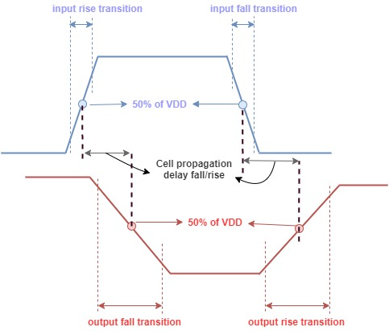</p>

NGSPICE Control Commands:   

```
* Measuring Rise Transition Time @ 20-80% of VDD(1.8V) 
        meas tran rt1 when v(Y)=1.44 RISE=2 
        meas tran rt2 when v(Y)=0.36 RISE=2
        let rise_tran = ((rt1-rt2)/1e-09)

* Measuring Cell Rise Time @ 50% of VDD(1.8V) 
        meas tran tinrise when v(A)=0.9 RISE=1 
        meas tran torise when v(Y)=0.9 RISE=1
        let crise = (torise-tinrise)/1e-09
        if abs(crise)>20
            meas tran tinrise when v(A)=0.9 FALL=1 
            meas tran torise when v(Y)=0.9 RISE=1
            let crise = abs(tinrise-torise)/1e-09
        end
```
### Constraints Measurement: Setup Time
The setup-time is measured using the bisection method. In this method, the reference circuit(case 1) propagation delay(tpd) times 1.1 factor is considered as the target tpd(case 2), whereas the high tpd is assumed to be undesired(case 4).    
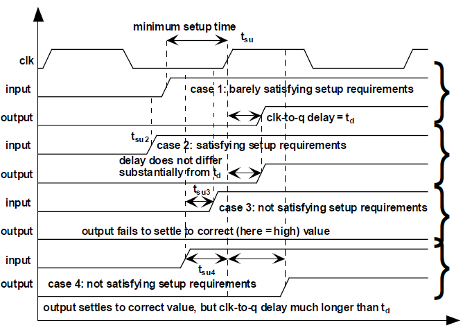
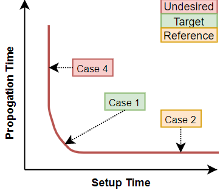

## Instruction to Generate Timing Liberty file
**Step 0: Perquisites based on Ubuntu OS**      
  * Software Requirements: NGSPICE and python 3   
  * Numpy module download: `$ pip3 install numpy`   
  * Clone the repository: `$ git clone https://github.com/vsdip/vsdStdCellCharacterizer_sky130.git`        
  * Change Directory to timing_arch: `$ cd vsdStdCellCharacterizer_sky130`
  * All the commands need to be run from the root directory i.e `user_name@PC_name:~/vsdStdCellCharacterizer_sky130$`

### Combination Cells

**Step 1: Edit config.py**
   * Enter custom cell folder, spice and lef file that needs to be characterized.
   * Mention input vectors for input delay and load capacitor.
   * Enter Logic function.
   * Enter Base Liberty File and output Liberty File

**sky130_fd_sc_hd__buf_1 example:**  [sky130_fd_sc_hd__buf_1 config.py](config.py)      
                 
  * Replace 'example/sky130_fd_sc_hd__buf_1/' directory with your cell working directory in config.py file.
  * Similarly replace spice file name `sky130_fd_sc_hd__buf_1.spice` and `sky130_fd_sc_hd__buf_1.lef` with your spice and lef file name. Make sure the spice format has the **subckt inside it with proper scaling factor**.           

**Step 2: Execute python file**       
    Enter command into terminal: `$ python3 combchar.py`

**Step 3: Ideal Run Final Output**:                             
    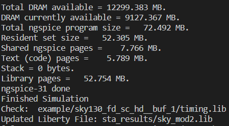

### Result Comparison between Skywater lib data and script data
[Skywater Liberty file Buf_1 ](sta_results/sky130_fd_sc_hd__typical.lib)    
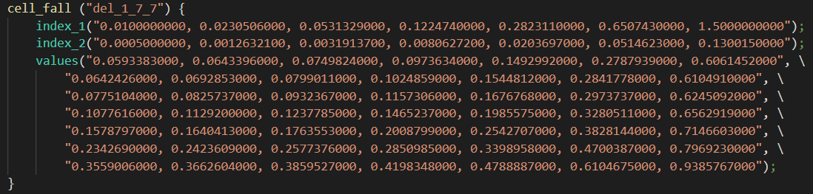   
[Generated Liberty file Buf_1 ](example/sky130_fd_sc_hd__buf_1/timing.lib)    
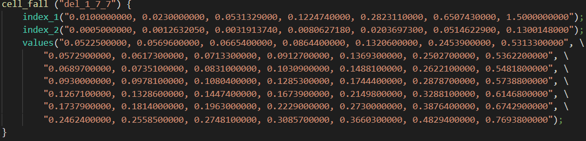   

### Simple D Flip-Flop

**Step 1: Edit default setting (Optional)**:   
  * Change variable under comment `Default values` in dff.py.     

**Step 2: Enter inputs lef and spice file**:    
Enter command into terminal: `$ python3 dff.py -lef example/sky130_fd_sc_hd__dfxtp_1/sky130_fd_sc_hd__dfxtp_1.lef -sp example/sky130_fd_sc_hd__dfxtp_1/sky130_fd_sc_hd__dfxtp_1.spice -lib sta_results/sky_mod2.lib `   
  
**Step 3: Enter User Inputs after running the script on terminal**:   
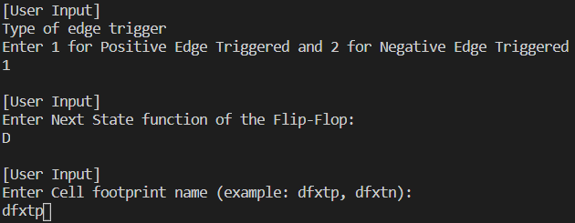

**Step 4: Ideal Run Final Output**:    
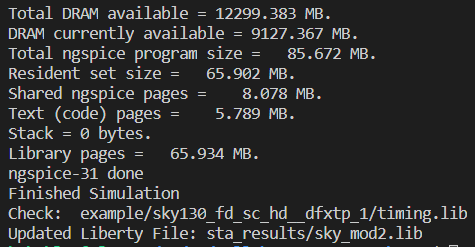

### Result Comparison between Skywater lib data and script data

[Skywater Liberty file DFF_1 ](sta_results/sky130_fd_sc_hd__typical.lib)      
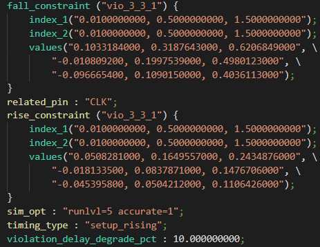      

[Generated Liberty file DFF_1 ](example/sky130_fd_sc_hd__dfxtp_1/timing.lib)     
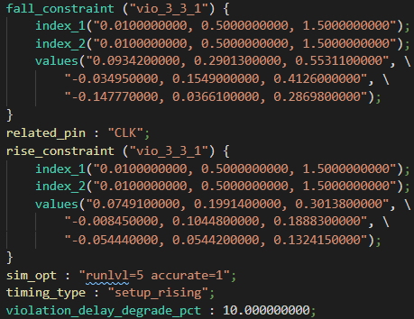   

## Verification of generated liberty file with OpenSTA
* Perquisites openSTA software. You could install using `sudo apt-get install openSTA`
* Change directory to sta_results: `$ cd sta_results`
* Replace `picorv32a.synthesis_optimized.txt` file name to `picorv32a.synthesis_optimized.v`    
* Edit the sta.conf and my_base.sdc as per your requirement.
* Run OpenSTA using command: `$ sta sta.conf`.
* Verify your cell of interest and make sure there is no warning due the liberty files.       
    

## Verification of generated Liberty File with OpenLane
### OpenLane Requirements
* Install OpenLane as mentioned in repo [OpenLANE Built Script](https://github.com/nickson-jose/openlane_build_script)
* [OpenLane Workshop repo for understanding openLane flow](https://github.com/harshsrigh/openlane_sky130nm_vsdworkshop)
### Custom Cells and Skywater 130nm Cells:

  * **Skywater Library cells**: sky130_fd_sc_hd__buf_2, and sky130_fd_sc_hd__conb_1.
  * **Custom cells**: sky130_vsdbuf_1x, sky130_vsdbuf_2x, sky130_vsdclkbuf_4x, sky130_vsdinv_1x, sky130_vsdinv_8x, sky130_vsdnand2_1x, sky130_vsdnand3_1x, sky130_vsdnand4_1x, sky130_vsdo21ai_1x and sky130_vsddfxtp_1.     
* **Liberty File**: [sky_mod1.lib](sta_results/sky_mod1.lib)    

### Synthesis Result
* Designed used for verification: picorv32a   
* Edit config.tcl to -      
  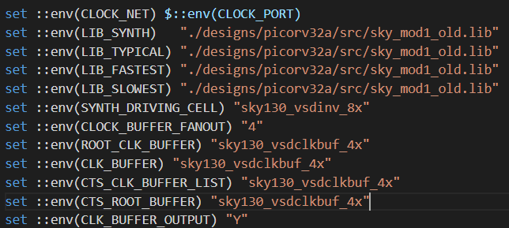
* Synthesis Result:   
  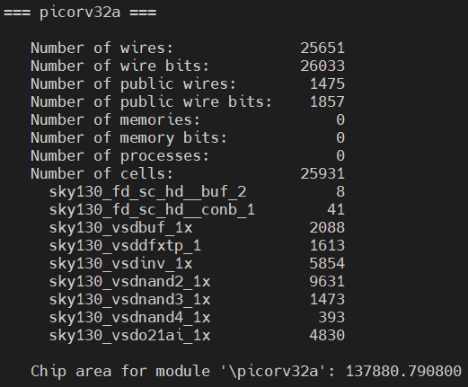

## Contact
* [Harsh Shukla](harshsrigh@gmail.com), MS Analog and Mixed Signal Design, Arizona State University

## Acknowledgement
* Kunal Ghosh, Co-founder, VSD Corp. Pvt. Ltd

* Openlane team, Efabless corporation
  
## Future Works:
* Implement tri-state and multiple output cells measurement.
* Try to generate number of timing arcs dynamically.
* Implement removal time, recovery time and minimum pulse width measurement for sequential cells. 


